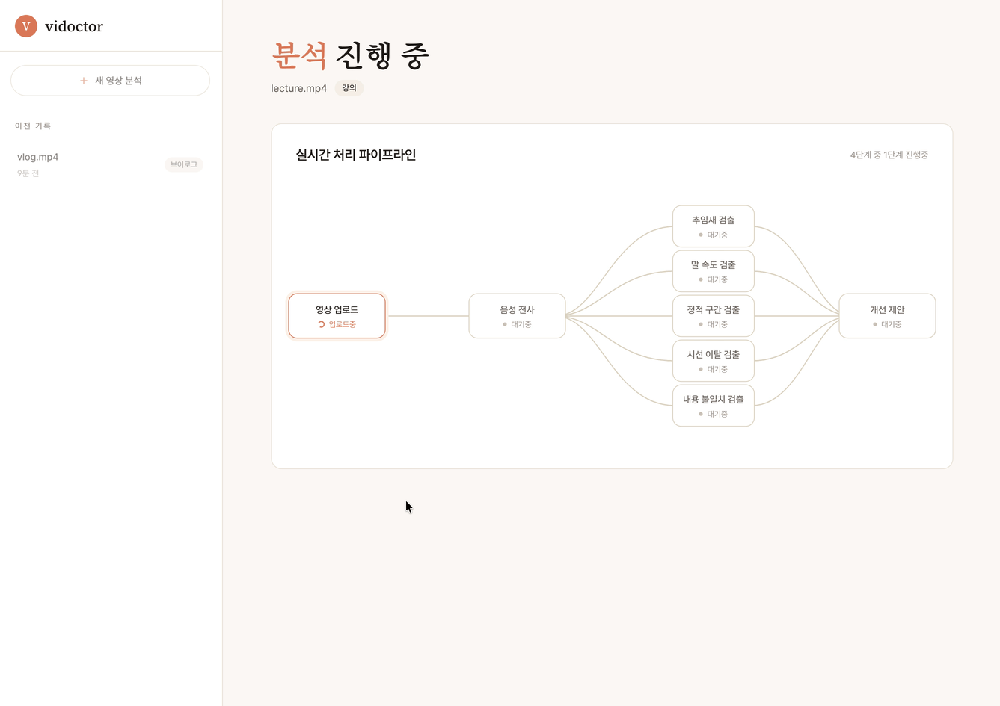
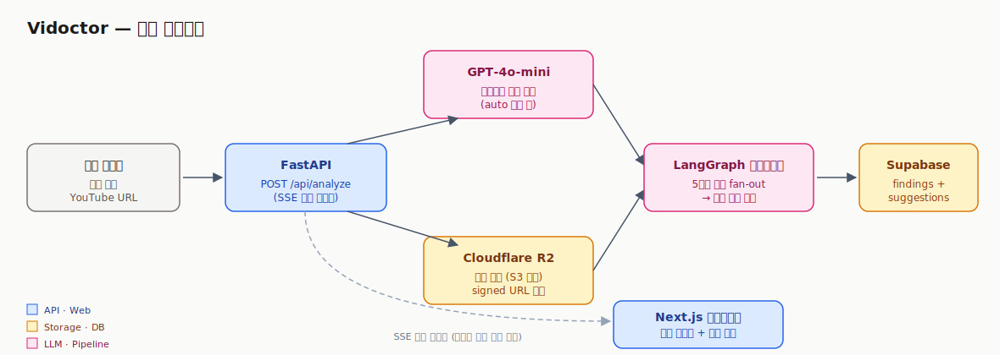
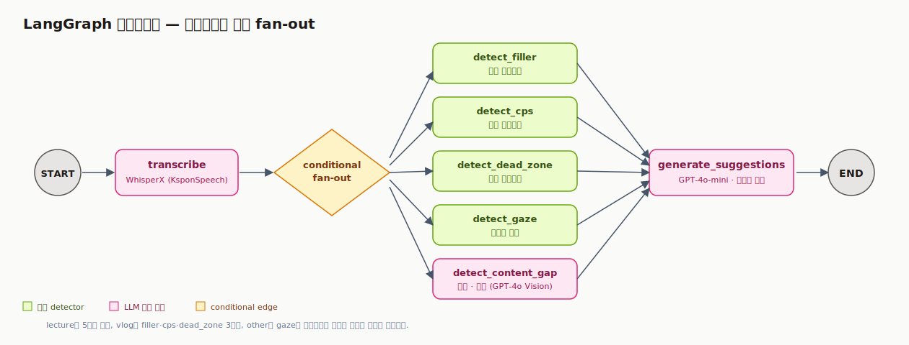
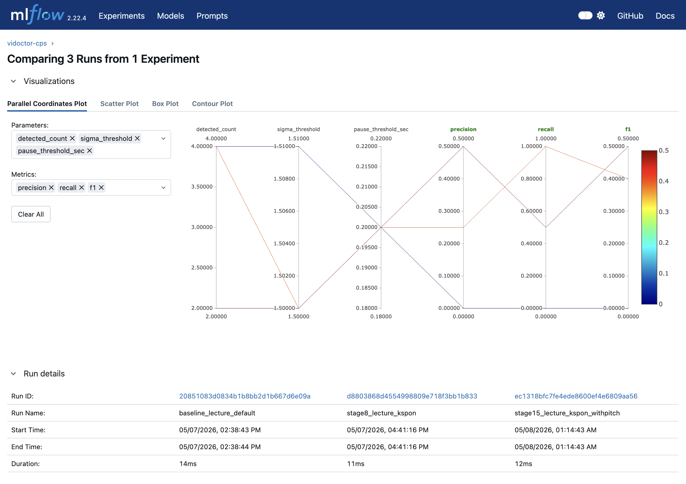

# Vidoctor

영상을 업로드하면 5차원으로 분석하고 개선점을 제안하는 **AI 영상 감수 에이전트**. 강의·브이로그·기타 카테고리에 맞춰 LangGraph가 활성 차원만 동적으로 골라 병렬 실행하고, 각 finding(분석에서 찾아낸 이슈 구간)을 LLM이 한국어 개선 제안으로 종합한다.


- **데모**: <https://vidoctor.app>
- **스택**: Python · FastAPI · LangGraph · LangChain · WhisperX · MediaPipe · OpenCV · GPT-4o Vision · Next.js 15 · Supabase · Cloudflare R2 · Langfuse · MLflow

---

## 5차원 분석

| 차원 | 활성 카테고리 | 핵심 신호 (쉽게) | 구현 |
|---|---|---|---|
| **Filler** | 전체 | "어·음·그·저" 같은 한국어 머뭇거림 + 같은 단어를 짧은 시간 안에 반복하는 burst | WhisperX(faster-whisper + wav2vec2 forced alignment)로 단어 단위 타임스탬프 추출 → 한국어 filler 사전 매칭 + 0.5s 이내 동일 어휘 burst를 한 finding으로 묶음 |
| **CPS** (말 속도) | 전체 | 영상 평균보다 두드러지게 빠르거나 느린 발화 구간 | 5초 윈도우 / 1초 스텝 슬라이딩으로 초당 글자수(Net CPS) 측정, 영상 평균 대비 ±1.5σ 이탈. 200ms 이상 멈춤과 filler는 계산에서 제외. vlog는 librosa pYIN으로 추출한 음높이(F0)를 AND 결합해 배경 노이즈 컷 |
| **Dead Zone** | 전체 | 말도 멈추고 화면도 거의 안 움직이는 정적 구간 | Silero VAD로 무발화 구간 추출 + **Farneback optical flow**(OpenCV의 dense optical flow — 인접 프레임 사이 픽셀별 움직임 벡터)의 프레임별 최대 움직임을 누적해 정적 여부 판정. 카테고리별 임계(강의 0.5 / 그 외 5.0)로 핸드헬드 카메라 미세 흔들림 흡수 |
| **Gaze** (시선 이탈) | 강의 | 강사가 카메라(정면)에서 시선이 벗어난 구간 | BlazeFace short-range로 작은 웹캠 영역 자동 추정(4코너 폴백 포함) → MediaPipe FaceLandmarker(478개 얼굴 점) → cv2.solvePnP로 **머리 회전각 yaw(좌우)·pitch(위아래)** 계산 → 영상 전체 median을 정면 baseline으로 차감 후 임계 |
| **Content Gap** (내용 공백) | 강의·기타 | 슬라이드에 쓴 내용과 실제 발화가 어긋나는 구간 | PySceneDetect 컷 경계 + 30초 균등 샘플링(최대 10장) → GPT-4o Vision multi-image + 카테고리별 rubric으로 "미스매치 키워드" 추출 → 그 키워드를 ASR 전사에서 검색해 실제 발화 시점으로 좁힘 |

영상 카테고리는 업로드 시 사용자가 선택하거나, **GPT-4o-mini Vision** 분류기가 시작·중간·후반 3프레임을 보고 자동 결정한다.



---

## 아키텍처

### 전체 흐름



업로드/유튜브 URL이 FastAPI SSE 엔드포인트로 들어오면 분류기·R2 업로드를 병렬 처리한 뒤 LangGraph가 5차원 분석을 실행한다. 결과는 Supabase에 저장하고, 클라이언트는 같은 SSE 채널로 노드 완료 이벤트를 실시간 구독한다.

### LangGraph 파이프라인



**LangGraph conditional fan-out**의 가치는 정적 DAG로 충분한 Airflow·Prefect와 갈리는 부분이다. `state["category"]`에 따라 `lecture`는 5차원 전체, `vlog`는 filler/cps/dead_zone 3차원, `other`는 gaze만 비활성으로 그래프 자체가 다르게 구성된다.

---

## 기술 스택과 선택 근거

### Frontend — Next.js 15 + Tailwind v4

- **Next.js App Router**: 가로형 5단계 파이프라인 SVG에 노드별 상태(대기/진행/완료/스킵)와 라인 애니메이션을 입히려면, 매 인터랙션마다 전체 페이지가 다시 그려지는 Streamlit으로는 구조적으로 불가능했음. SSE 스트림을 브라우저에서 직접 구독해 idle / analyzing / result 3-state 머신으로 구성.
- **Tailwind v4**: 디자인 토큰을 CSS variables로 정의해 컴포넌트별 일관성 강제.

### Backend — FastAPI + asyncio

- **FastAPI**: SSE 스트림 구현이 자연스럽고 Pydantic 통합으로 schema-first. LangGraph의 동기 노드 완료 콜백을 asyncio 큐로 받아 메인 코루틴이 SSE 이벤트로 yield하는 패턴.
- **세마포어 동시성 가드**: WhisperX·MediaPipe 모델 각 1~2GB RAM이라 무제한 동시 분석은 메모리 초과(OOM) 위험. 동시 분석 2건 + 15분 타임아웃 hard cap으로 시연 안정성 확보.
- **클라이언트 disconnect 처리**: SSE는 연결이 자주 끊기는 게 정상이라 이를 invariant로 가정하고, 끊김 발생 시 in-progress 상태로 남은 DB 행을 fail로 마무리.

### ML / AI

| 영역 | 선택 | 근거 |
|---|---|---|
| **ASR** | WhisperX (faster-whisper) + **KsponSpeech fine-tuned 한국어 모델** | **wav2vec2 forced alignment** — 음성 신호와 단어를 음소(phoneme) 단위로 정밀 정렬해 단어 타임스탬프를 ±20ms로 추출(Whisper 기본 ±200ms 대비 10배). 한국어 짧은 비언어 음("음·어")은 다국어 base 모델이 단어로 인식하지 못해 KsponSpeech fine-tuned 모델을 **ctranslate2 + int8 양자화**(CPU 추론 속도·메모리 최적화)로 변환해 채택. 강의 filler F1 0.44 → 1.00의 결정적 개선 수단(아래 회고) |
| **VAD** | Silero VAD (MIT, 언어 독립) | 발화/무발화 구간을 음성 신호에서 직접 측정. ASR word timestamp가 침묵을 단어 끝점에 흡수해 발생하던 정렬 오류를 우회 |
| **F0** | librosa pYIN | vlog 환경에서 cps 단독 분포가 라벨러 인지("속사포")와 부분 겹쳐 분리 한계 → F0 평균·range를 AND 결합. F0 결합이 사실상 메인 화자 vs 배경 노이즈 분리기로 작동하는 발견(아래 회고) |
| **Optical flow** | OpenCV Farneback dense flow, per-frame **max** median | per-frame mean을 쓰면 큰 정적 영역(슬라이드)이 작은 영역(페이스캠) 움직임을 묻어 사용자 인지와 분리 못 함. max로 한 픽셀 큰 움직임도 보존 |
| **얼굴/시선** | BlazeFace short-range로 ROI 자동 추정(전체 → 4코너 폴백) → MediaPipe FaceLandmarker(478 landmark) → cv2.solvePnP head pose | 강의 영상은 화자 얼굴이 화면의 1~5%만 차지하면 FaceLandmarker가 학습 분포 벗어남 → BlazeFace로 ROI 먼저 좁힌 뒤 landmarker 호출. iris offset 단독은 head pose 변화에 false positive 다수라 SolvePnP head pose 결합 |
| **VLM** | GPT-4o Vision (멀티이미지 batch, 5~10장/콜) | 영어 우세 OSS VLM은 한국어 슬라이드·자막 인식 정확도가 프로덕션 부적합. multi-image batch로 호출당 token 비용 분산 (3분 영상 8~10장이 한 호출) |
| **개선 제안** | GPT-4o-mini + LangChain structured output | 카테고리별 하드코딩된 가이드 없이 차원 신호의 일반적 의미만 rubric에 정의 — 영상 도메인은 finding 패턴 + transcript에서 LLM이 추정. LLM이 만들어낸 가짜 finding 참조(예: 존재하지 않는 `filler:99`)는 저장 직전에 검증·제거 |
| **모델 무결성** | MediaPipe Tasks 모델은 SHA256 검증 후 캐시 | Google CDN의 `latest` 경로는 무공지 교체 가능 → 받은 파일 hash 불일치 시 fail-loud + 골든셋 재평가 사이클로 의식적 갱신 |

### Pipeline · Observability

- **LangGraph**: conditional edge로 카테고리별 5차원 fan-out. 노드 완료 stream을 SSE 이벤트로 그대로 노출.
- **LangChain ChatOpenAI**: LLM 응답을 Pydantic 스키마로 강제(structured output) + OpenAI rate limit(429) 일시 폭주는 지수 백오프로 흡수 + 개별 호출 60초 타임아웃으로 hang 차단. 분류기·내용 공백·개선 제안 모두 동일 헬퍼를 거쳐 호출당 비용·지연·토큰을 자동 측정.
- **Langfuse**: ChatOpenAI에 콜백 한 줄 부착해 모든 LLM 호출 자동 trace. 프롬프트 버전·토큰·지연·실패 케이스 한 대시보드에서 확인. 오픈소스 · self-host 가능 · 프레임워크 중립.
- **MLflow**: 차원별 experiment(`vidoctor-{dim}`)에 baseline → stage_n 이름으로 파라미터·메트릭 기록. 모든 검출 차원 튜닝은 *MLflow run을 기준선으로 두고 개선 수단 하나씩 바꿔 효과 측정* 사이클로 진행 — 실패한 시도도 run 단위로 남아 회고 자료가 됨.

### Storage · Infra

- **Cloudflare R2**: S3 호환 · **다운로드 트래픽(egress) 무과금** · 무료 10GB · 단일 파일 5TB. boto3 SDK 그대로 사용 가능. 영상 원본을 트림·압축 없이 보존하고 클라이언트는 만료 시간 있는 임시 URL(signed URL)로 영상을 range request 스트리밍.
- **Supabase Postgres**: 메타 + findings(start_sec/end_sec/payload JSONB) + suggestions. 차원별 고유 필드는 payload JSONB로 직렬화·역직렬화해 단일 테이블 유지. **단일 사용자 가정이라 행 단위 보안(Row Level Security) 대신 service-role 키로 운영**.
- **uv + mise**: 의존성·Python 버전 lock. `mise install` 한 번으로 환경 일치.

---

## 검출 차원 튜닝 회고

각 차원이 baseline에서 어떤 한계에 막혔고 어떻게 풀었는지. MLflow에 모든 stage가 run으로 남아 있어 개선 수단별 효과를 정량 비교했다.

### CPS — 영상 평균 ±σ 정책 + F0 결합

- **문제**: 초기엔 절대 임계(<3 or >9 CPS) AND ±2σ로 잡았다. 화자별 정상 발화 속도 편차가 커서 4 CPS 화자가 갑자기 8 CPS로 빨라져도 절대 임계 미달로 누락. 절대값 자체도 한국어 평균에서 따온 자의적 보편값.
- **해결 1**: 절대 임계 제거, 영상 평균 ±1.5σ relative만 사용. σ가 매우 작은 평탄 영상은 `MIN_STDEV=0.5` 가드로 스킵.
- **해결 2**: filler 단어를 분모(net speech)·분자(chars) 양쪽에서 제외. "음·어"의 짧은 글자수 + 짧은 시간이 cps를 인공적으로 낮춰 too_slow false positive 만드는 패턴 정리.
- **해결 3 (vlog 한정)**: cps 1차원 분포가 라벨러 인지와 부분 겹쳐 성능 한계에 부딪침. **librosa pYIN으로 추출한 F0 평균·range를 AND 결합**. 처음엔 "톤 상승 = 속사포 보강"이라는 가설로 도입했지만, 실제로 F0 결합이 잘라낸 false positive 영역이 사용자 청취 검증 시 "메인 화자 발화 아님(배경 노이즈)"과 정확히 일치 — **F0 결합은 사실상 메인 화자 분리기로 작동한다고 관점을 다시 정의**.
- **카테고리 분기**: lecture는 통제된 녹화로 노이즈 적어 F0 결합이 라벨 cut 부작용만 → cps 단독. vlog는 야외 핸드헬드라 노이즈 다수 → F0 AND. *결과 차이가 아니라 녹화 환경 차이*가 분기 근거.
- **결과**: vlog Precision **0.80** 도달(baseline 0.33), F1 0.35 → 0.67. lecture F1 0.80.

### Filler — 한국어 fine-tuned ASR 모델 교체가 결정적

- **문제**: 영어 우세로 학습된 Whisper 가족이 한국어 짧은 비언어 음("음·어·으·에")을 단어로 인식하지 않음. baseline lecture F1 0.44 / vlog 0.18. 라벨 영역의 ASR 토큰을 직접 dump해 보니 *vlog 라벨 5개 중 4개에서 ASR 토큰 0개*로, detector 단의 사전·임계 튜닝으로는 닿을 수 없음을 데이터로 확정.
- **해결 1**: hotwords boost / VAD 임계 완화 / 모델 layer 교체 모두 학습 분포 한계엔 무력함을 3실험으로 확정한 뒤, **KsponSpeech fine-tuned Whisper를 ctranslate2 + int8 양자화로 변환**해 WhisperX 흐름에 그대로 끼움. wav2vec2 forced alignment 단계는 유지.
- **해결 2**: 사전 정리. 강의 논리 연결사 "그러니까/그래서" 제외(false positive 원천), 주의 환기 표지 "자" 추가.
- **해결 3**: 사전 외 단어 반복 검출 제거. "강아지 강아지" 같은 호명·강조 케이스가 vlog에서 우세해 알고리즘 가정("인접 동일어 = 발화 비유창성(disfluency)")이 깨짐. **사전 단어 인접 반복**만 burst로 묶음 — 사용자가 보는 finding 노이즈 11→0개.
- **해결 4**: 평가 tolerance ±1s. 라벨러 1초 단위 라운딩 + 모델 ±20ms 정밀도 격차 흡수(NIST STT 표준 ±200ms는 우리 라벨에 너무 좁음).
- **결과**: lecture F1 0.44 → **1.00**. vlog F1 0.18 → 0.32(짧은 호흡·자음 클로저를 "음·어"로 환각 인식하는 ASR 모델의 한계가 본질적 성능 한계).

### Dead Zone — VAD + Optical flow per-frame max + 카테고리 임계

- **문제 1 (ASR 우회 필요)**: 초기 정책은 ASR word timestamp의 무발화 구간을 썼는데, WhisperX가 "갈게요." 단어 끝점을 다음 발화 직전까지 침묵으로 흡수해(7.5초 길이, 한국어 단어 p95의 8배 outlier) silence가 발화로 잡힘 → **Silero VAD로 직접 측정**.
- **문제 2 (SSIM 한계)**: 초기 시각 신호로 SSIM(structural similarity)을 썼는데, 사용자가 직접 검증한 가짜 dead zone이 라벨보다 *더 정적*으로 측정됨(SSIM 0.977 vs 라벨 0.79). 큰 정적 영역(하늘·바닥)이 작은 영역 움직임을 묻어 사용자 인지와 분리 못 함이 본질.
- **해결**: **OpenCV Farneback optical flow magnitude의 per-frame max median**으로 픽셀 움직임 직접 측정. mean 대신 max를 쓴 이유는 lecture 페이스캠처럼 화면의 1%만 차지하는 작은 움직임도 보존하기 위함(라벨 max 0.838 vs 가짜 FP max 2.69로 안전마진 분리).
- **카테고리 분기**: vlog 핸드헬드는 정적 영상도 카메라 미세 흔들림으로 max 절대값이 lecture(삼각대)보다 5~10배 커서 단일 임계로 분리 불가능 → lecture 0.5 / vlog·other 5.0.
- **결과**: lecture·vlog 모두 F1 **1.0**(TP=1·2 / FP=0).

### Gaze — baseline 차감 + 짧은 이탈 보존

- **문제**: 절대 임계(yaw 20°/pitch 15°) baseline에서 F1=0. 영상 전체 pitch median이 -9.1°로 systematic offset 발생. 무캘리 환경의 `cv2.solvePnP` + `decomposeProjectionMatrix`는 카메라 위치·euler 분해 컨벤션에 따라 영상별 ±수~십도 offset을 만들어 절대 임계가 영상마다 흔들림.
- **해결 1**: **영상 전체 yaw/pitch median을 정면 baseline으로 차감**. 강의 도메인 가정(강사가 시간 대부분 정면 응시)이 강해 median이 robust한 정면 추정값.
- **해결 2**: 짧은 휙 동작을 잡되 짧은 검출과 4초 라벨 사이 **IoU(Intersection over Union — 두 구간이 얼마나 겹치는지 비율, 1.0이 완전 일치)** 를 확보하기 위해 `MIN_DURATION=0.6s` + `MERGE_GAP=1.0s`로 인접 짧은 이탈을 한 이벤트로 묶음.
- **해결 3**: 합성 회전 입력으로 부호 컨벤션 박제 검증(yaw>0=강사 우측, pitch>0=강사 머리 아래). UI는 시청자 입장 한국어로 좌우 반전 표기.
- **결과**: F1 0.0 → **1.0** (라벨 1개 한정, 표본 한계는 명시).

### Content Gap — 의미는 LLM, 시간은 ASR

- **문제 1 (의미)**: baseline LLM이 "갑작스러운 등장" 같은 표면 신호로 잡고 라벨 본질(슬라이드 시각 vs 발화 미스매치)을 짚지 못함. F1 0.67은 시간대 우연 매칭.
- **해결 1**: rubric을 "슬라이드 텍스트·도식이 표시한 용어와 강사 발화 단어가 다른 경우"를 1순위로 명시. 흐름 어색·짧은 추임새·ASR 윈도우 분할은 negative로 명시.
- **문제 2 (시간)**: rubric 정밀화 후 F1 1.0이지만 detected `[80.7, 105.0]s`가 라벨 `[94, 102]s`보다 14초 앞섬. LLM은 frame image + ±15s transcript window에서 *공간적*으로 추정해 슬라이드가 표시된 전체 구간을 잡는 경향.
- **해결 2**: **LLM은 의미, ASR은 시간을 책임지도록 분리**. LLM이 미스매치 핵심 키워드를 description과 별도로 추출하면, 후처리가 LLM이 짚은 구간 ±5초 안에서 그 키워드를 ASR 전사에서 검색해 실제 발화 시점으로 좁힘. 키워드 매칭은 정확 일치 → 부분 문자열 fallback 순으로 한국어 ASR 오인식을 흡수.
- **해결 3**: 음성 윈도우 양 끝에 `…` 마커를 붙이고 rubric에 "인접 구간 연속, 끊김 아님"을 명시해, ASR 분할이 만들어내는 가짜 누락 신호 차단.
- **결과**: F1 0.67 → **1.00**, IoU 0.27 → **0.69**. 비용 약 $0.02/호출, 3.3~3.6s.

### Generate Suggestions — 도메인 오버핏 회피

- 카테고리별 하드코딩된 가이드(예: "강의는 슬라이드 다듬기") 없이 **차원 신호의 일반적 의미만 rubric에 정의**(filler=전달력, cps=청취 부담, dead_zone=이탈 위험, gaze=응시 안정성, content_gap=시각·발화 불일치). 영상 도메인은 finding 패턴 + transcript에서 LLM이 추정해 톤 조정.
- **LLM 환각 방어**: LLM이 만들어낸 가짜 finding 참조(예: 존재하지 않는 `filler:99`)를 저장 직전에 검증·제거하고, 모든 참조가 무효면 suggestion 자체를 drop. 환각률은 INFO 로그로 추적.
- **비용·지연 가시성**: LLM 호출마다 비용·지연·토큰을 측정해 LangGraph state에 누적 → 분석 종료 시 합산해 DB에 보존. UI 분석 카드에 총 비용·처리 시간 + 단계별 분리 표시.

### 공통 교훈

- **모든 변경은 lecture/vlog 두 카테고리 동시 평가**. 한쪽만 보면 다른 쪽 깎이는 케이스 다수(cps F0 결합, filler 사전 단음절 제거 등).
- **알고리즘 개선의 성능 한계와 라벨 데이터 품질의 성능 한계는 다르다**. CPS에서 알고리즘 시도 7~14가 F1 0.46 영역에 막혔다가, 본인이 직접 45분 청취해 라벨을 다듬은 뒤 같은 detector로 0.67 도달.
- **상관관계 우회로의 가치와 한계를 둘 다 인지한다**. F0 결합은 "흥분 톤"보다 "메인 화자 분리"로 작동 — vlog 골든셋엔 들어맞지만 차분한 빠름·합성 음성엔 무력.
- **상용 ASR SOTA(State of the Art — 현 시점 최고 성능)가 우리 도메인의 SOTA는 아니다**. CLOVA Speech는 한국어 전사 품질 SOTA지만 깨끗한 transcript 정책상 filler를 자동 제거해 발화 비유창성(disfluency) 검출엔 부적합.

---

## API

| Endpoint | 설명 |
|---|---|
| `POST /api/analyze` | 파일 업로드 또는 YouTube URL(youtube.com / youtu.be, 10분 cap) + 카테고리(`auto` 가능) → SSE 진행 스트림(`status`/`category`/`uploaded`/`node`/`complete`/`error`) |
| `GET /api/analyses` | 최근 분석 리스트 |
| `GET /api/analyses/{id}` | 분석 상세 (findings + suggestions + step metrics, 4개 DB 쿼리를 비동기 병렬 fetch) |
| `GET /api/analyses/{id}/video-url` | R2 객체 signed URL(2시간 만료) |
| `DELETE /api/analyses/{id}` | 영상 + 모든 관련 분석·findings·suggestions cascade 삭제 |

전체 schema는 `/docs`(OpenAPI).

---

## 셋업

```bash
# Python 버전 + uv (mise가 자동 활성화)
mise install

# 의존성
uv sync

# 환경 변수
cp .env.example .env
# .env 채우기 — OPENAI / SUPABASE / R2 / LANGFUSE 키
```

### 외부 인프라

- **Supabase**: 프로젝트 생성 후 `supabase/migrations/`의 SQL을 번호 순으로 SQL Editor에서 실행.
- **Cloudflare R2**: 버킷 생성 → Account API token(Object Read & Write, 해당 버킷 한정) 발급 → Access Key ID / Secret Access Key / Endpoint URL을 `.env`에 채움.
- **Langfuse**: cloud free tier(50k events/월) 가입 → public/secret key 발급.

### 실행

```bash
# 백엔드 (FastAPI + SSE) — 터미널 1
uv run uvicorn vidoctor.api:app --reload --port 8000

# 프론트엔드 (Next.js) — 터미널 2
cd web && npm install && npm run dev
# → http://localhost:3000

# 테스트
uv run pytest
```

### MLflow UI (선택)

```bash
# 평가 스크립트가 mlruns/에 자동 기록한 run 시각화
# macOS 5000번 포트는 AirPlay Receiver가 점유하므로 5001 사용
uv run mlflow ui --port 5001
# → http://localhost:5001
```


