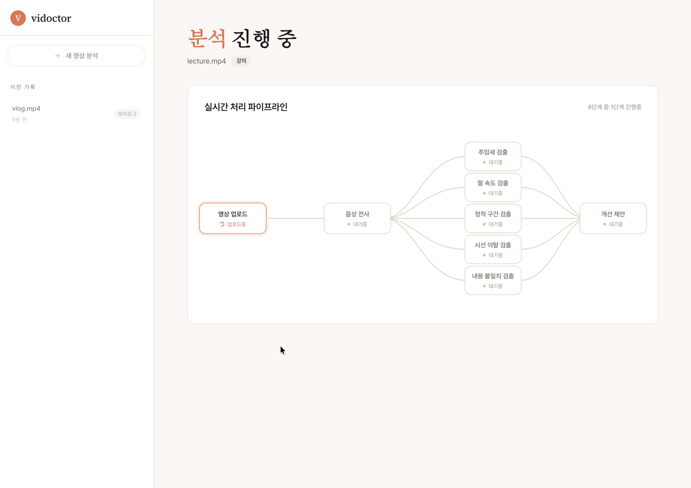
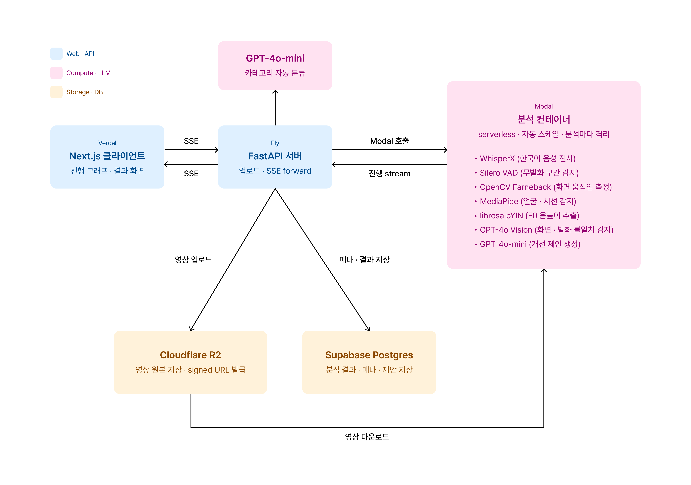
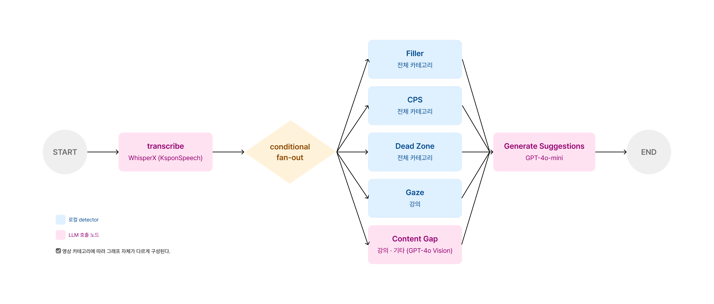
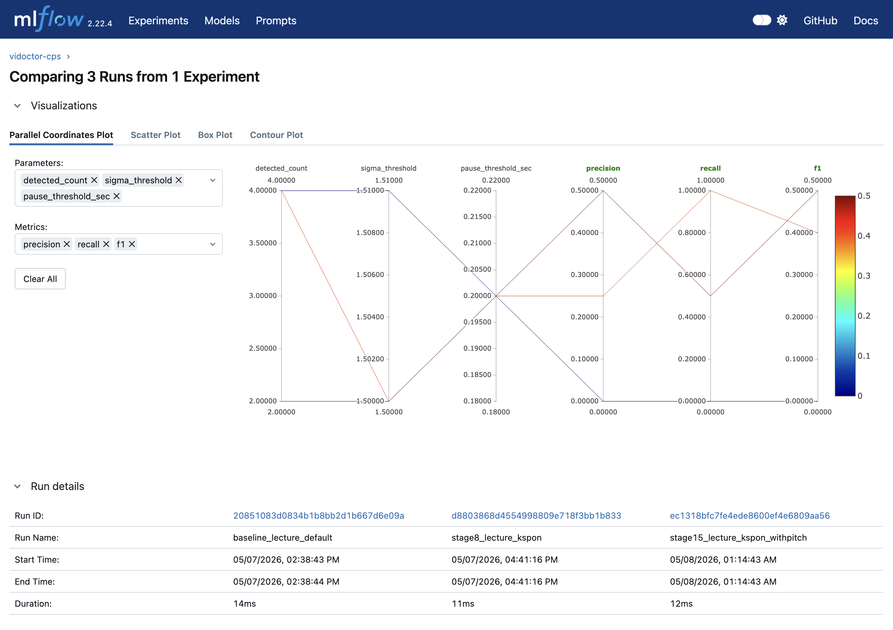

# Vidoctor

영상을 업로드하면 5차원으로 분석하고 개선점을 제안하는 **영상 진단 에이전트**입니다. 영상 유형(강의·브이로그·기타)에 맞춰 분석할 항목을 자동으로 고른 후 개선 포인트를 안내합니다.

**데모**: <https://vidoctor.app>


---

## 5차원 분석

**Filler — 말 머뭇거림**
- **적용 대상**: 모든 영상
- "어·음·그·저" 같은 한국어 머뭇거림을 찾습니다.
- 음성을 단어 단위로 받아쓴 뒤 머뭇거림 사전과 대조합니다. "어 어 어"처럼 같은 머뭇거림이 0.5초 안에 연속되면 묶고, 어휘가 달라도 5초 안에 이어지는 머뭇거림은 하나의 구간으로 묶어 사용자에게 보여줍니다. 한 구간이 60초를 넘어가는 경우에는 별도 구간으로 나눠 알립니다.

**CPS — 말 속도**
- **적용 대상**: 모든 영상
- 영상 평균보다 두드러지게 빠르거나 느린 발화 구간을 찾습니다.
- 초당 글자 수를 계산해 영상 전체 평균에서 크게 벗어난 구간을 잡습니다. 멈춤 시간(200ms 이상)과 머뭇거리는 말은 속도 계산에서 제외합니다. 브이로그는 강의 영상에 비해 주변 소음이 많아 음높이까지 함께 확인해서 메인 화자가 아닌 소리는 걸러냅니다.

**Dead Zone — 멈춘 구간**
- **적용 대상**: 모든 영상
- 말을 멈추고 화면도 거의 움직이지 않는 정적 구간을 찾습니다.
- 발화가 끊긴 구간을 음성에서 추출하고, 동시에 화면의 움직임 정도를 측정해 둘 다 멈춰있는 구간을 찾습니다. 강의(삼각대 촬영)와 브이로그(손에 들고 찍는 영상)는 화면 흔들림 정도가 달라 임계값을 다르게 적용합니다. 강의는 0.5로 작은 움직임까지 검출하고, 브이로그는 5.0으로 자연스러운 손떨림은 허용합니다.

**Gaze — 시선 이탈**
- **적용 대상**: 강의 영상
- 강사의 시선이 카메라 정면을 벗어난 구간을 찾습니다. 
- 얼굴을 인식한 뒤 머리의 좌우·상하 회전 각도를 계산합니다. 카메라 위치에 따라 정면 방향이 영상마다 다르기 때문에, 강사가 영상 내내 가장 많이 응시한 방향을 그 영상의 "정면 기준"으로 잡습니다. 그 기준에서 크게 벗어난 구간을 시선 이탈로 판정합니다. 

**Content Gap — 화면과 발화 불일치**
- **적용 대상**: 강의·기타 영상
- 강의 영상에서는 슬라이드와 강사 발화가 서로 엇갈리는 구간을, 기타 영상에서는 화면과 음성만으로 무엇을 다루는지 파악하기 어려운 구간을 찾습니다.
- 장면 전환 시점과 일정 간격으로 프레임을 추출한 뒤, GPT-4o Vision이 화면과 음성 전사를 분석해 불일치 구간을 찾아냅니다.

영상 카테고리는 업로드 시 사용자가 직접 선택하거나, **GPT-4o-mini Vision** 분류기가 시작·중간·후반 3프레임을 보고 자동으로 결정합니다.



---

## 아키텍처

### 전체 흐름



업로드/유튜브 URL이 FastAPI 서버로 들어오면, 카테고리 분류와 R2 업로드가 병렬로 진행됩니다. 이후 5차원 분석은 Modal의 serverless 컨테이너로 위임되며, 각 단계의 진행 상황은 SSE 스트림으로 사용자 화면에 실시간 전달되고 최종 결과는 Supabase에 저장됩니다. ML 컨테이너는 한 분석을 마치면 종료되어 메모리가 다음 분석에 누적되지 않고, 동시 요청이 늘면 Modal이 컨테이너를 자동으로 늘려 안정적으로 처리합니다.

### LangGraph 파이프라인



LangGraph는 카테고리에 따라 분석 차원을 다르게 구성합니다. 강의 영상에는 5차원 전체가, 브이로그에는 Filler·CPS·Dead Zone 3차원이, 기타 영상에는 Gaze를 제외한 4차원이 적용됩니다.

---

## 기술 스택

### Frontend — Next.js + Tailwind

| 항목 | 설명 |
|---|---|
| **Next.js** | 분석 진행 상황을 시각화하는 UI를 구현하는 데 사용합니다. 각 분석 단계의 상태(대기·진행·완료·스킵)와 단계 사이를 잇는 라인 애니메이션을 부분 업데이트로 표현해야 했는데, 인터랙션마다 전체 페이지를 다시 그리는 Streamlit으로는 불가능해 Next.js를 선택했습니다. SSE 스트림을 브라우저에서 구독해 idle·analyzing·result 3-state 상태 머신으로 화면을 업데이트합니다. |
| **Tailwind** | 컴포넌트 전반의 디자인 일관성을 유지하는 데 사용합니다. 색상·간격·타이포그래피 등 디자인 토큰을 CSS variables로 정의해 한 곳에서 관리합니다. |

### Backend — FastAPI + asyncio

| 항목 | 설명 |
|---|---|
| **FastAPI** | 분석 요청 처리와 SSE 스트리밍을 담당하는 API 서버로 사용합니다. SSE 스트림 구현이 간결하고, Pydantic 스키마로 요청·응답 형식을 먼저 정의해 API를 자동으로 검증·문서화합니다. LangGraph의 각 분석 단계가 완료될 때마다 해당 결과를 받아 SSE 스트림으로 클라이언트에 전송합니다. |
| **Semaphore 동시성 가드** | 동시에 처리되는 분석 수를 제한해 API 서버가 R2 업로드와 DB 쓰기로 과부하되는 상황을 방지합니다. 동시 분석은 5건까지 허용하고, 한 건이 15분을 넘기면 응답이 멈춘 것으로 보고 강제 종료해 다른 요청에 영향이 가지 않도록 합니다. |
| **클라이언트 disconnect 처리** | SSE 연결 끊김 시 백엔드 리소스를 정리하는 데 사용합니다. SSE 연결은 페이지 이탈이나 네트워크·환경 요인으로 끊기는 경우가 잦은데, 끊김을 감지하면 진행 중이던 분석을 중단하고 DB에 남은 '분석 중' 상태 기록을 실패로 정리합니다. |

### Models & Algorithms

| 영역 | 항목 | 설명 |
|---|---|---|
| **ASR** | WhisperX (KsponSpeech 한국어 모델) | Filler·CPS·Content Gap 검출의 기반이 되는 음성 전사를 생성합니다. 음성을 음소(phoneme) 단위로 정밀 분석해 단어의 시작과 끝 시점을 ±20ms 오차로 추출합니다. Whisper 기본 ±200ms 대비 10배 정밀해, 짧게 연속되는 머뭇거림을 각 개선점으로 분리하지 않고 하나로 묶어 노이즈를 줄입니다. 다만 다국어 기본 모델은 한국어의 짧은 비언어 음("음·어")을 단어로 인식하지 못해, 한국어로 fine-tuned된 KsponSpeech 모델로 교체했습니다. 이 모델을 ctranslate2와 int8 양자화로 변환해 CPU 추론 속도를 높이고 메모리 사용량을 줄였습니다. |
| **VAD** | Silero VAD | Dead Zone 검출에 활용할 발화·무발화 구간을 음성 신호에서 직접 측정합니다. WhisperX는 단어 끝의 침묵까지 단어 끝점으로 잡아 무발화 구간의 시작점이 부정확한데, 음성 신호에서 직접 측정하면 이 오류를 피할 수 있습니다. |
| **F0** | librosa pYIN | CPS 검출에서 메인 화자와 배경 소음을 분리하기 위해 사용합니다. 음높이의 평균과 변동폭을 함께 확인해 메인 화자가 빠르게 말하는 구간을 판단합니다. 다만 강의 영상은 배경 노이즈가 적고 음높이가 단조로워 정상 발화까지 잘릴 수 있어, 브이로그에서만 적용합니다. |
| **Optical flow** | OpenCV Farneback dense flow | Dead Zone 검출에서 화면 움직임을 측정하는 데 사용합니다. 픽셀 움직임의 평균값으로 측정하면 강의 슬라이드처럼 큰 정적 영역이 페이스캠처럼 작은 움직임을 상쇄해, 강사가 움직이는 구간도 정적으로 오판될 수 있습니다. 이를 방지하기 위해 프레임 내 움직임 최댓값을 기준으로 사용하여 화면의 작은 움직임까지 검출합니다. |
| **얼굴/시선** | • BlazeFace short-range<br>• MediaPipe FaceLandmarker<br>• cv2.solvePnP | Gaze 검출에서 강사의 머리 회전 각도를 계산하는 데 사용합니다. 강의 영상에서 강사 얼굴이 화면의 1~5%만 차지하는 경우가 많은데, FaceLandmarker는 화면을 채운 큰 얼굴을 가정해 학습되어 작은 얼굴에서는 정확도가 떨어집니다. 따라서 BlazeFace로 얼굴 영역을 먼저 검출해 분석 범위를 좁힙니다. 이후 FaceLandmarker가 478개의 얼굴 특징점을 추출하고, cv2.solvePnP로 머리의 좌우·상하 회전 각도를 계산합니다. |
| **VLM** | GPT-4o Vision | Content Gap 검출에서 화면과 발화의 불일치를 분석하는 데 사용합니다. 여러 프레임을 한 번에 묶어 호출하는 방식으로 API 비용을 줄였습니다(3분 영상 기준 호출 1회당 8~10개의 프레임을 처리합니다). |
| **개선 제안** | GPT-4o-mini | 5차원 검출 결과를 종합해 개선 제안을 생성합니다. LLM에는 각 차원이 시청자 경험에 미치는 영향을 간략히 제공하고, 영상 주제와 도메인은 LLM이 검출 결과와 음성 전사에서 직접 추정해 제안의 톤을 맞춤화합니다. 각 제안에는 근거가 된 검출 결과 식별자(예: `filler:0`)가 포함되는데, LLM이 존재하지 않는 식별자(예: `filler:99`)를 생성한 경우 저장 직전에 검증·제거하여 환각 응답을 차단합니다. |

### Pipeline · Observability

| 항목 | 설명 |
|---|---|
| **LangGraph** | 5차원 분석을 영상 카테고리에 따라 다르게 구성하는 데 사용합니다. 카테고리별로 활성 차원을 분기해 병렬 실행하며, 각 노드가 완료될 때마다 해당 이벤트를 SSE 스트림으로 클라이언트에 실시간 전달합니다. |
| **LangChain ChatOpenAI** | 카테고리 분류·Content Gap·개선 제안 등 모든 LLM 호출에 사용합니다. Pydantic 스키마로 응답 형식을 고정해 일관된 구조로 받습니다. OpenAI 응답 한도를 초과(429)하면 재시도 간격을 점차 늘려 자동 재시도하고, 개별 호출은 60초 안에 응답이 오지 않으면 중단합니다. 공통 헬퍼를 거치도록 통일해 호출당 비용·지연 시간·토큰 사용량을 자동으로 측정합니다. |
| **Langfuse** | LLM 호출을 추적·모니터링하는 데 사용합니다. ChatOpenAI에 콜백을 부착해 모든 호출을 자동으로 기록하고, 프롬프트 버전·토큰·지연 시간·실패 사례를 통합 대시보드에서 확인할 수 있습니다. |
| **MLflow** | 검출 차원 튜닝 실험을 기록·비교하는 데 사용합니다. 각 차원마다 별도의 experiment를 만들어, baseline run과 후속 stage run의 파라미터·메트릭을 함께 기록합니다. 모든 차원 튜닝은 baseline 위에 변수를 하나씩 바꿔 변화를 측정하는 사이클로 진행했으며, 실패한 시도도 그대로 보존되어 회고 자료로 활용됩니다. |

### Storage · Infra

| 항목 | 설명 |
|---|---|
| **Fly.io** | FastAPI 서버를 호스팅합니다. 무거운 ML 분석은 Modal에 위임하는 구조라 메모리·CPU 부담이 적어 소형 인스턴스로 가볍게 운영합니다. 머신을 상시 가동해 첫 요청 시 발생할 수 있는 초기 지연을 사전에 차단합니다. |
| **Modal** | ML 분석 컨테이너를 호스팅합니다. 분석 요청마다 별도의 컨테이너가 생성되어 WhisperX·MediaPipe·GPT-4o Vision 등 모델이 실행되고, 작업이 끝나면 컨테이너가 종료되어 사용한 자원이 모두 반환되므로 매 요청이 동일한 조건에서 처리됩니다. 요청량이 늘어나면 컨테이너 수가 자동으로 확장되어 안정적으로 처리됩니다. |
| **Cloudflare R2** | 업로드된 영상 원본을 저장·스트리밍하는 데 사용합니다. S3 호환 인터페이스를 제공해 boto3 SDK를 그대로 활용할 수 있으며, 다운로드 트래픽이 무과금이라 영상 스트리밍 비용 부담이 없습니다. 영상은 트림·압축 없이 원본 그대로 보존하고, 클라이언트는 임시 URL(signed URL)을 통해 영상 전체가 아닌 현재 재생 위치만 받아오는 방식으로 스트리밍합니다. |
| **Supabase Postgres** | 영상 메타 정보, 검출 결과, 개선 제안을 저장하는 데 사용합니다. 5차원 검출 결과를 하나의 테이블에 통합 저장하며, 차원마다 다른 상세 정보는 JSONB 컬럼에 담아 스키마 변경 없이 확장할 수 있는 구조로 설계했습니다. |

---

## 검출 차원 튜닝 회고

baseline에서 각 차원이 어떤 한계에 부딪혔고 어떻게 풀었는지 정리했습니다. 모든 stage를 MLflow run으로 기록해 변수별 효과를 정량적으로 비교했습니다.

| 차원 | F1 변화 | 핵심 변경 |
|---|---|---|
| **Filler** | • 강의 0.44 → **1.00**<br>• 브이로그 0.18 → 0.43 | KsponSpeech fine-tuned Whisper 교체 + 인접한 머뭇거림 구간 묶기 |
| **CPS** | • 강의 0.80<br>• 브이로그 0.35 → **0.67** (Precision 0.33 → 0.80) | F0 결합 + 영상 평균 ±σ 정책 |
| **Dead Zone** | • 강의 **1.00**<br>• 브이로그 **1.00** | Silero VAD + Optical flow per-frame max |
| **Gaze** | • 강의 0.0 → **1.00**<br>• 브이로그 미지원 | 영상별 카메라 위치 보정 + 인접한 짧은 시선 이탈 묶기 |
| **Content Gap** | • 강의 0.67 → **1.00** (IoU 0.27 → 0.69)<br>• 브이로그 미지원 | LLM이 키워드 추출 + ASR 전사에서 시점 매칭 |

<details>
<summary><strong>Filler</strong></summary>

- **문제**: 주로 영어로 학습된 Whisper 계열 모델은 한국어의 짧은 비언어 음("음·어·으·에")을 단어로 인식하지 못합니다. baseline F1은 강의 0.44, 브이로그 0.18로 모두 낮았습니다. 정답 라벨 구간의 ASR 출력을 직접 확인해보니 *브이로그 라벨 5개 중 4개 구간을 제대로 찾아내지 못해*, 단어 사전 보강이나 burst 임계값을 조정해도 해결할 수 없는 ASR 모델 자체의 한계임을 데이터로 확인했습니다.
- **해결 1**: 모델 자체를 바꾸지 않고 시도한 세 가지가 모두 무력함을 확인했습니다.
  - ASR에 머뭇거림 단어를 힌트로 주는 **hotword** 주입
  - 짧은 음도 ASR에 전달되도록 **음성 구간 검출(VAD) 임계 완화**
  - **Whisper 모델 일부 layer 교체**

  영어 위주로 학습된 모델이 한국어 짧은 비언어 음을 학습한 적이 없다는 본질적 한계 때문입니다. 결국 **한국어로 fine-tune된 KsponSpeech Whisper 모델을 ctranslate2와 int8 양자화로 변환**해 WhisperX 흐름에 그대로 적용했습니다.
- **상용 SOTA 검토**: CLOVA Speech는 한국어 전사 품질 SOTA지만, 직접 평가해보니 전사 결과에 머뭇거림 단어가 거의 포함되지 않아 발화 비유창성(disfluency) 검출에는 부적합했습니다. **상용 SOTA가 우리 도메인의 SOTA는 아니라는 것을 알게 되었습니다**.
- **해결 2**: 사전 외 단어 반복 검출을 제거했습니다. 브이로그에서 "강아지! 강아지!" 같은 호명·강조 케이스가 많아, 인접한 같은 단어 반복을 발화 비유창성(disfluency)으로 보던 가정이 성립하지 않았습니다. **사전 단어의 인접 반복**만 하나의 구간으로 묶도록 정리했고, 브이로그 평가에서 호명·강조로 잘못 잡히던 11건이 0건으로 줄었습니다.
- **해결 3**: 머뭇거림 단어 사전을 다듬었습니다. 강의에서 논리 연결로 자주 쓰이는 "그러니까/그래서"는 머뭇거림이 아닌데도 잘못 잡히는 경우가 많아 제외했고, 청중 주의를 환기할 때 쓰는 "자"("자, 이제…")를 추가했습니다.
- **해결 4**: 한국어 모델 교체로 짧은 비언어 음 검출률이 올라가자, 한 머뭇거림 구간 안에 어휘가 다른 사례("음·자·어·그·이제·뭐랄까")가 각각 별도 알림으로 노출되어 노이즈가 늘었습니다. 음성 분석 분야에서 짧은 휴지로 끊긴 발화를 하나의 구간으로 합치는 일반적 방식을 따라, 같은 어휘 반복뿐 아니라 **어휘가 달라도 5초 안에 이어지는 머뭇거림**까지 한 구간으로 묶도록 정책을 확장했습니다. 다만 한 구간이 너무 길어지면 모든 머뭇거림이 한 알림에 묻혀버리므로, 60초를 넘어가는 경우에는 별도 구간으로 나눠 보여줍니다. 강의 평가 데이터 기준 한 구간 안의 검출 수가 15건 → 3건으로 줄어, 사용자에게 노출되는 알림 노이즈가 5배 감소했습니다.
- **해결 5**: 정답 라벨은 1초 단위로 기록되어 있는 반면 모델 정밀도는 ±20ms로, 두 정밀도의 격차를 보정하기 위해 평가 허용 오차를 ±1초로 적용했습니다.
- **결과**: 강의 F1 0.44 → **1.00**, 브이로그 F1 0.18 → 0.32. 브이로그의 추가 개선은 ASR 모델 자체의 본질적 한계로 제한되었습니다. 짧은 숨소리나 자음 발음 직전의 짧은 멈춤을 모델이 "음·어"로 잘못 인식하는 환각 현상이 주요 원인으로 관찰되었습니다.

</details>

<details>
<summary><strong>CPS</strong></summary>

- **문제**: 초기에는 초당 글자 수가 3 미만이거나 9 초과(절대 임계)이면서 동시에 영상 평균에서 ±2σ 이상 벗어난 구간만 비정상으로 판정했습니다. 그러나 화자마다 정상 발화 속도 편차가 커서, 평소 4 CPS인 화자가 8 CPS로 빨라져도 절대 임계 9를 넘지 못해 누락되었습니다. 절대값 기준 자체도 한국어 평균에서 임의로 가져온 보편값이었습니다.
- **해결 1**: 절대 임계를 제거하고 영상 평균 대비 ±1.5σ 이탈만으로 판정하도록 변경했습니다. 다만 발화 속도가 일정한 영상(σ 0.5 CPS 미만)은 미세한 변동도 이탈로 잡힐 수 있어 검출에서 제외합니다.
- **해결 2**: 발화 속도 계산에서 머뭇거림 단어를 제외했습니다. "음·어" 같은 머뭇거림은 글자 수가 짧지만 긴 발화 시간을 차지해 윈도우 안의 CPS를 인위적으로 낮춥니다. 그 결과 머뭇거림이 섞인 정상 구간이 '느린 발화'로 잘못 판정되는 문제를 해결했습니다.
- **해결 3 (브이로그 한정)**: CPS만으로는 라벨러가 정상으로 인지한 구간까지 빠른 발화로 잡아내는 오탐(False Positive)이 있었습니다. "흥분하면 음높이가 올라가니, 음높이를 결합하면 진짜 속사포만 걸러낼 수 있을 것"이라는 가설을 세우고 librosa pYIN으로 추출한 음높이의 평균과 변동 폭을 함께 적용했습니다. 그러나 실제로는 음높이가 올라가지 않아도 빠르게 말하는 구간이 확인되어 가설은 들어맞지 않았습니다. 오히려 F0으로 걸러낸 구간을 직접 확인해보니 메인 화자가 아닌 배경 소음이었습니다. 음높이의 진짜 역할은 **흥분 톤 검출이 아니라 메인 화자와 배경 소음을 분리하는 것**이었습니다. 다만 이는 배경 노이즈가 있는 환경에 한정된 효과로, 차분한 톤으로 빠르게 말하는 케이스나 합성 음성(TTS)처럼 음높이 변동이 적은 입력에는 무력합니다.
- **카테고리 분기**: 강의 영상은 통제된 녹화 환경이라 노이즈가 적어, F0 결합 시 정상 라벨까지 잘라내는 부작용이 발생합니다. 따라서 강의는 CPS 단독으로 검출하고, 야외 촬영으로 노이즈가 많은 브이로그에만 F0를 함께 적용합니다. 녹화 환경의 차이가 성능 차이로 이어지기 때문에 카테고리별로 분기 처리합니다.
- **결과**: 강의 F1 0.80, 브이로그 F1 0.35 → **0.67** (Precision 0.33 → 0.80).

</details>

<details>
<summary><strong>Dead Zone</strong></summary>

- **문제 1 (ASR 우회 필요)**: 초기에는 ASR의 단어 타임스탬프에서 무발화 구간을 추출했습니다. 그러나 WhisperX가 단어의 끝점에 뒤따르는 침묵까지 단어로 포함해버려, "갈게요." 한 단어가 7.5초 길이로 잡히는 경우가 있었습니다. 한국어 단어로는 이례적으로 긴 이상치로, 결과적으로 침묵 구간이 발화로 잘못 분류되었습니다.
- **해결 1**: ASR이 아닌 **Silero VAD로 음성 신호에서 무발화 구간을 직접 측정**하도록 변경했습니다.
- **문제 2 (SSIM 한계)**: 초기에는 두 프레임의 유사도를 SSIM으로 측정해 화면 변화를 추적했습니다. SSIM은 픽셀별 단순 차이가 아니라 밝기·대비·구조 패턴을 종합해 비교하는 지표로, 0~1 사이 값을 가지며 1에 가까울수록 두 프레임이 비슷해 화면이 정적임을 의미합니다. 그러나 슬라이드처럼 큰 정적 영역이 화면 대부분을 차지하면 페이스캠의 작은 움직임이 평균에 묻혀버려, 사람이 인지하는 움직임에 비해 더 정적으로 측정되는 문제가 있었습니다.
- **해결 2**: **OpenCV Farneback optical flow로 픽셀 움직임을 직접 측정**합니다. 각 프레임 안 모든 픽셀의 움직임 중 가장 큰 값을 추출하고, 영상 전체에서 최댓값들의 중앙값을 사용합니다. 평균이 아닌 최댓값을 사용함으로써 강의 영상의 페이스캠처럼 화면의 1%만 차지하는 작은 움직임도 검출합니다.
- **카테고리 분기**: 브이로그는 손에 들고 촬영하는 특성상 정적 영상에서도 카메라의 미세한 흔들림이 발생해, 픽셀 움직임 최댓값이 삼각대 촬영의 강의보다 5~10배 크게 측정됩니다. 두 카테고리에 같은 임계값을 적용하면 한쪽이 오탐되거나 누락되므로, 강의는 0.5, 브이로그·기타는 5.0으로 카테고리별 임계값을 다르게 설정합니다.
- **결과**: 강의·브이로그 모두 F1 **1.00**

</details>

<details>
<summary><strong>Gaze</strong></summary>

- **문제**: 초기에는 좌우 회전(yaw) 20°, 상하 회전(pitch) 15° 이상이면 시선 이탈로 판정하는 절대 임계값을 적용했지만 baseline F1은 0이었습니다. 강사가 카메라 정면을 정확히 응시하지 않을 경우, 육안으로는 정면 응시처럼 보이더라도 cv2.solvePnP는 머리가 회전된 것으로 계산합니다. 이 편향은 카메라 설치 위치에 따라 다르게 발생합니다. 실제로 한 영상에서는 pitch 중앙값이 -9.1°까지 치우쳐 절대 임계값으로는 시선 이탈을 안정적으로 판정하기 어려웠습니다.
- **해결 1**: **영상 전체의 yaw·pitch 중앙값을 정면 기준으로 계산합니다**. 강의 영상에서는 강사가 정면을 응시한다고 가정하기 때문에, 중앙값이 안정적인 정면 기준 역할을 합니다.
- **카테고리 분기**: 브이로그는 화면에 화자의 얼굴 대신 풍경이나 다른 대상을 비추는 경우가 많아 시선을 안정적으로 측정할 수 없습니다. 따라서 Gaze 검출은 강의 영상에만 적용합니다.
- **해결 2**: 강사가 짧게 휙 시선을 돌리는 동작도 검출하되, 1초 이내로 인접한 이탈은 하나의 이벤트로 묶어 검출 결과 노이즈를 줄입니다.
- **결과**: 강의 F1 0.0 → **1.00** (라벨 1건으로 표본 한계가 있습니다).

</details>

<details>
<summary><strong>Content Gap</strong></summary>

- **문제 1 (의미)**: Content Gap은 슬라이드 화면과 강사 발화 내용이 의미적으로 어긋나는 구간을 찾는 것입니다. 그러나 초기 LLM은 의미적 불일치 대신 슬라이드의 표면적 변화(갑작스러운 등장, 새 도식 출현 등)만 보고 검출했습니다. baseline F1이 0.67로 나왔지만, 실제로는 불일치를 검출한 게 아니라 타임라인과 우연히 맞은 결과였습니다.
- **해결 1**: 평가 기준(rubric)에 "슬라이드 텍스트·도식 용어와 강사 발화 단어가 다른 경우"를 1순위 검출 대상으로 명시했습니다. 흐름이 어색한 경우, 짧은 추임새, ASR 윈도우 분할로 발생하는 가짜 단절은 검출 대상이 아님을 함께 명시했습니다.
- **카테고리 분기**: 강의 영상에서는 슬라이드 화면과 강사 발화 내용이 다르면 시청자 이해에 치명적이지만, 브이로그는 화면과 발화 내용이 달라도 자연스럽기 때문에 Content Gap은 강의·기타 영상에만 적용하고 브이로그는 비활성화합니다.
- **문제 2 (시간)**: 평가 기준 정밀화로 F1은 1.0에 도달했지만, 검출 시점이 실제 라벨보다 14초가량 앞서는 문제가 있었습니다. LLM이 ±15초 전사 윈도우 안에서 슬라이드가 표시된 전체 구간을 불일치 구간으로 잡는 경향이 있기 때문입니다.
- **해결 2**: **LLM이 의미를, ASR이 시점을 책임지도록 역할을 분리**했습니다. LLM이 불일치 구간의 핵심 키워드를 추출하면, ASR 전사에서 키워드를 추출한 시점 ±5초 범위 내로 키워드를 검색해 실제 발화 시점으로 보정합니다. 키워드가 정확하게 일치하는지 먼저 확인하고, 실패 시 부분 문자열 매칭으로 fallback합니다.
- **해결 3**: 음성 전사 윈도우 양 끝에 `…` 마커를 붙이고 평가 기준에 "인접 구간 연속, 끊김 아님"을 명시해, ASR이 전사를 윈도우 단위로 자르면서 발화가 누락되는 것처럼 보이는 현상을 차단합니다.
- **결과**: 강의 F1 0.67 → **1.00** (IoU 0.27 → **0.69**, 라벨 1건으로 표본 한계가 있습니다). 호출당 약 $0.02 비용, 처리 시간 3.3~3.6초.

</details>

<details>
<summary><strong>Generate Suggestions</strong></summary>

- **도메인 오버핏 회피**: 카테고리별로 하드코딩된 가이드(예: "강의는 슬라이드 다듬기")를 두지 않고 **각 차원의 일반적 의미만 평가 기준(rubric)에 정의**했습니다. Filler는 전달력, CPS는 청취 부담, Dead Zone은 시청자 이탈 위험, Gaze는 응시 안정성, Content Gap은 시각·발화 불일치를 의미합니다. 영상의 구체적 도메인은 검출 결과와 음성 전사에서 LLM이 추정해 제안의 톤을 조정합니다.
- **LLM 환각 방어**: LLM이 만들어낸 잘못된 검출 결과 식별자를 저장 직전에 검증·제거하고, 유효한 참조가 하나도 없으면 제안 자체를 폐기합니다. 환각 발생률은 로그로 추적합니다.
- **비용·지연 가시성**: LLM 호출마다 비용·지연 시간·토큰 사용량을 측정해 LangGraph 상태에 누적하고, 분석이 완료되면 합산해 DB에 저장합니다. UI 분석 결과에 총 비용·처리 시간과 단계별 내역을 표시합니다.

</details>

<details>
<summary><strong>공통 교훈</strong></summary>

- **모든 변경은 강의·브이로그 두 카테고리에서 동시에 평가합니다**. 한 카테고리에만 최적화할 경우 다른 카테고리의 성능이 저하되는 경우가 발생하기 때문입니다. CPS의 F0 결합, Dead Zone의 카테고리별 임계값 분기, Filler의 사전 외 단어 반복 검출 제거가 대표적인 사례입니다.

</details>

---

## 운영 인프라 회고

검출 정확도와 별개로, 공개 서비스를 안정적으로 운영하기 위해 인프라 구조를 두 차례 정리했습니다.

| 영역 | 효과 | 핵심 변경 |
|---|---|---|
| **분석 실행** | • 동시 분석 1건 → **5건**<br>• 누적 OOM **0건**<br>• Fly 인스턴스 16GB → 4GB | 단일 머신 → Modal serverless 마이그레이션 |
| **의존성 관리** | Fly 이미지 ~3GB → **~500MB** | WhisperX·MediaPipe 등 ML 의존성을 Modal 빌드에만 포함하도록 분리 |

<details>
<summary><strong>분석 실행</strong></summary>

- **문제**: 초기에는 Fly 단일 머신 안에서 FastAPI와 ML 분석을 함께 실행했습니다. WhisperX·MediaPipe 같은 대형 모델은 분석이 끝나도 OS에 메모리를 즉시 반환하지 않아 분석을 거듭할수록 사용량이 누적되었고, 결국 OOM으로 머신이 강제 종료되어 1~2분의 다운타임이 반복적으로 발생했습니다.
- **해결 1**: 머신 사양을 4GB → 8GB → 16GB로 확대해봤지만 메모리 누적 시점만 늦출 뿐 근본 해결이 되지 않았고, 정액 인프라 비용만 2배로 증가했습니다.
- **해결 2**: 분석 요청마다 서브프로세스를 띄워 종료 시 메모리를 강제로 회수하도록 바꿨습니다. 누적 OOM은 사라졌지만, 매 분석마다 1.5GB ML 모델을 새로 로드하는 비용이 발생해 첫 응답까지 5~7분이 소요되어 UX가 크게 악화되었습니다.
- **해결 3**: ML 분석을 Modal 컨테이너로 위임했습니다. 분석마다 격리된 컨테이너에서 실행되어 메모리 누적이 구조적으로 차단되고, 동시 요청이 늘면 컨테이너가 자동으로 확장되어 안정적으로 처리합니다. 사용량 기반 과금이라 트래픽이 몰릴 때만 비용이 늘어나는 구조로 바뀌었습니다.
- **결과**: 동시 분석 한도 1건 → **5건**, 누적 OOM **0건**, Fly 인스턴스 사양 16GB → 4GB로 축소.

</details>

<details>
<summary><strong>의존성 관리</strong></summary>

- **문제**: 초기에는 모든 dependencies를 단일 목록으로 관리해, 실제로 ML 분석을 수행하지 않는 Fly API 서버 이미지에도 WhisperX·MediaPipe·Torch 같은 대형 라이브러리가 함께 포함되었습니다. 그 결과 이미지 크기가 약 3GB까지 늘어 빌드와 배포 시간이 길어졌습니다.
- **해결**: ML 분석에만 필요한 dependencies를 별도로 분리해 Fly 이미지에는 API 서버 운영에 필요한 dependencies만 포함되도록 정리했습니다.
- **결과**: Fly 이미지 크기 ~3GB → **~500MB**, 빌드 시간 5~10분 → 2~3분으로 축소.

</details>

---

## 비용 관리와 악용 방지

공개 서비스로 운영되며 영상 분석마다 OpenAI API 비용이 발생하는 구조이므로, 3중 안전망을 구축해 봇이나 악의적 사용을 차단합니다.

| 계층 | 한도 | 차단 방식 |
|---|---|---|
| **동시성 제한** | 동시 분석 5건 | 동시에 처리되는 분석 수를 제한해 API 서버 과부하와 OpenAI 호출 비용 폭증을 함께 방지합니다. |
| **IP 호출 제한** | • IP당 시간 5건<br>• IP당 일 15건 | Fly의 `fly-client-ip` 헤더를 사용해 프록시를 거치더라도 실제 클라이언트의 IP를 식별합니다. `slowapi` 라이브러리가 한도 초과 시 429 응답으로 자동 차단합니다. |
| **일일 총 사용량 한도** | 일 100건 | IP 호출 제한을 우회하더라도 전체 사용량이 일일 한도를 초과하면 SSE 에러로 차단해 OpenAI 비용 폭증을 방지합니다. |

한도에 도달하면 사용자에게 에러 메시지를 보여주고, 운영자는 Langfuse 대시보드에서 LLM 호출별 비용과 실패 케이스를 실시간으로 추적할 수 있습니다.

---

## 셋업

```bash
# Python 버전과 uv 설치 (mise가 자동 활성화)
mise install

# 의존성 설치
uv sync --extra analyze

# 환경 변수 설정
cp .env.example .env
# .env에 OPENAI, SUPABASE, R2, LANGFUSE 키를 입력합니다
```

### 외부 인프라

- **Modal**: 가입 후 `uv run modal token new`로 CLI 인증을 마칩니다. Dashboard에서 `vidoctor-secrets`를 생성해 OPENAI·SUPABASE·R2·LANGFUSE 자격증명을 등록한 뒤, `uv run modal deploy vidoctor_modal.py`로 분석 함수를 등록하면 로컬 서버가 이를 호출해 분석을 수행합니다.
- **Supabase**: 프로젝트를 생성한 뒤 `supabase/migrations/`의 SQL을 번호 순으로 SQL Editor에서 실행합니다.
- **Cloudflare R2**: 버킷을 생성하고 Account API 토큰(Object Read & Write)을 발급한 뒤, Access Key ID, Secret Access Key, Endpoint URL을 `.env`에 입력합니다.
- **Langfuse**: 가입한 뒤 public/secret 키를 발급받습니다.

### 실행

```bash
# 백엔드 (FastAPI + SSE) — 터미널 1
uv run uvicorn vidoctor.api:app --reload --port 8000

# 프론트엔드 (Next.js) — 터미널 2
cd web && npm install && npm run dev
# → http://localhost:3000

# 테스트 실행
uv run pytest
```

### MLflow UI

```bash
# mlruns/ 디렉토리에 기록된 평가 run을 시각화합니다
# macOS의 5000번 포트는 AirPlay Receiver가 점유하므로 5001 포트를 사용합니다
uv run mlflow ui --port 5001
# → http://localhost:5001
```


